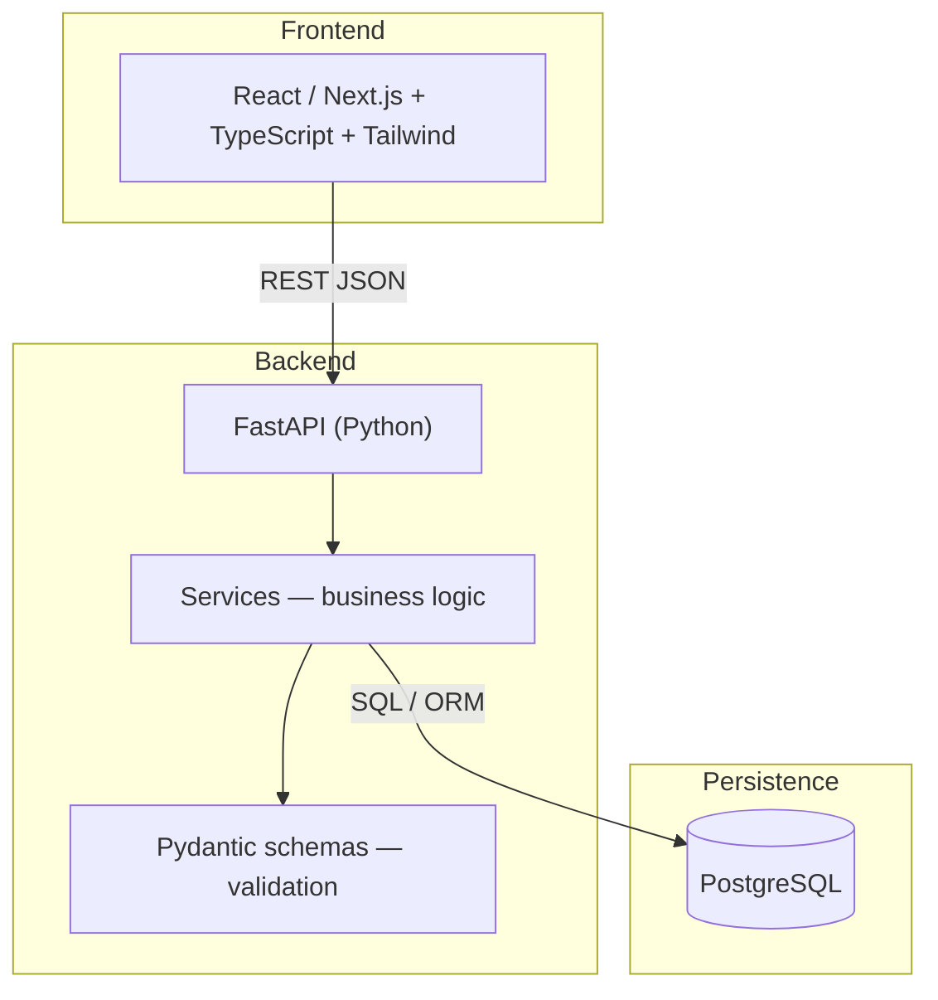
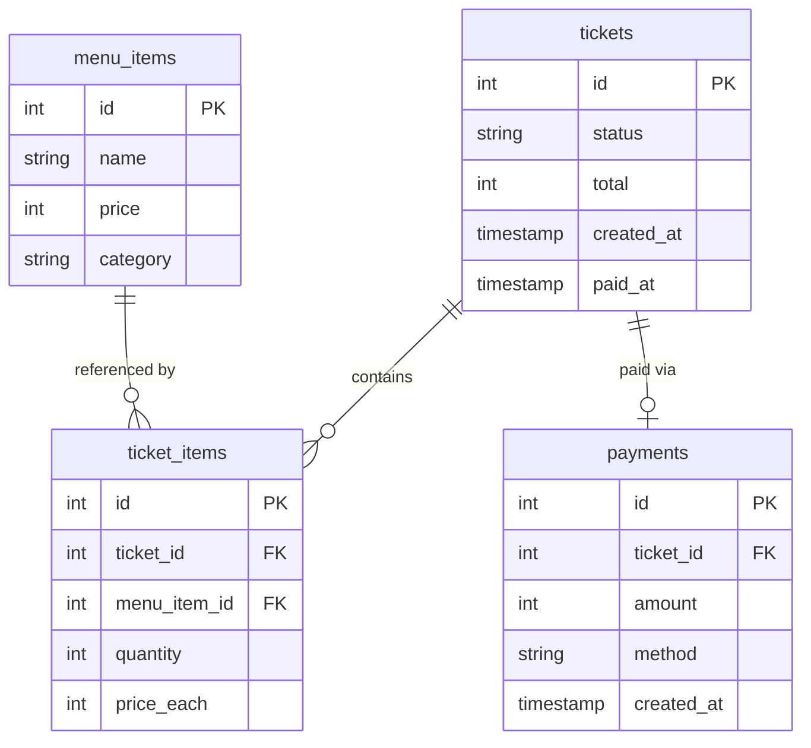

<p align="center">
  
</p>

<h1 align="center">🍻 BarTicket API</h1>

<p align="center">
  <strong>Architecture & API design showcase</strong> for a production bar point-of-sale system.
</p>

<p align="center">
  <em>This repo documents the system design. Full implementation is in a private repository.</em>
</p>

<p align="center">
  <a href="#overview">Overview</a> ·
  <a href="#architecture">Architecture</a> ·
  <a href="#api-design">API</a> ·
  <a href="#database">Database</a> ·
  <a href="#design-decisions">Decisions</a> ·
  <a href="#demo">Demo</a>
</p>

---

## Overview

**BarTicket** is a lightweight bar POS built for Version 1. Staff open tickets, add menu items, take payments, and review same-day analytics — without enterprise POS complexity.

| Principle | What it means |
|-----------|----------------|
| **Simple** | Few screens, obvious flows, minimal configuration |
| **Fast** | Optimized for tap-and-go during peak hours |
| **Reliable** | Clear ticket states, consistent totals, predictable API |

> **V1 goal:** Ship something usable in a real bar before adding voice, inventory, or payment processors.

### Scope (V1)

| Domain | Capabilities |
|--------|--------------|
| **Tickets** | Create, add/remove line items, status: `open` · `paid` · `cancelled` |
| **Menu** | Items with prices, organized by category (Beer, Cocktails, Wine, …) |
| **Payments** | Mark paid via `cash` · `card` · `other` |
| **Analytics** | Today's sales, ticket count, top-selling items |

---

## Architecture



| Layer | Stack | Responsibility |
|-------|--------|----------------|
| **Frontend** | TypeScript, React, Next.js, Tailwind | Ticket board, menu, payment UI |
| **Backend** | Python, FastAPI | Business rules, validation, API contracts |
| **Database** | PostgreSQL | Durable state, referential integrity |

### Backend layout

```
backend/
├── app/
│   ├── api/          # Route handlers (thin)
│   ├── services/     # Business logic
│   ├── models/       # DB models
│   └── schemas/      # Pydantic request/response
├── main.py
└── requirements.txt
```

**Request flow:** Frontend → FastAPI route → service layer → PostgreSQL → clean JSON response.

---

## API design

Base URL (local): `http://localhost:8000`

Monetary values use **integer cents** (e.g. `700` = ¥7.00 / $7.00) to avoid floating-point rounding bugs.

### Endpoints

| Method | Endpoint | Description |
|--------|----------|-------------|
| `GET` | `/health` | Health check |
| `GET` | `/menu` | List menu items |
| `POST` | `/menu` | Create menu item |
| `GET` | `/tickets` | List tickets (filter by status) |
| `POST` | `/tickets` | Create open ticket |
| `GET` | `/tickets/{id}` | Ticket detail with line items |
| `POST` | `/tickets/{id}/items` | Add item to ticket |
| `DELETE` | `/tickets/{id}/items/{item_id}` | Remove line item |
| `POST` | `/tickets/{id}/pay` | Mark paid, record payment |
| `GET` | `/analytics/today` | Daily sales summary |

### Example — ticket response

```json
{
  "ticket_id": 1,
  "status": "open",
  "items": [
    {
      "name": "House Lager",
      "quantity": 2,
      "price_each": 700,
      "subtotal": 1400
    }
  ],
  "total": 1400
}
```

### Example — pay ticket

```http
POST /tickets/1/pay
Content-Type: application/json

{
  "method": "card",
  "amount": 1400
}
```

### Example — analytics

```json
{
  "date": "2026-05-27",
  "total_sales": 45200,
  "ticket_count": 38,
  "top_items": [
    { "name": "House Lager", "quantity_sold": 24 },
    { "name": "Margarita", "quantity_sold": 11 }
  ]
}
```

---

## Database



| Table | Purpose |
|-------|---------|
| `menu_items` | Catalog — name, price (cents), category |
| `tickets` | Check header — status, cached total, timestamps |
| `ticket_items` | Line items — quantity + **price snapshot** at time of add |
| `payments` | Payment record — amount, method, timestamp |

---

## Design decisions

| Decision | Rationale |
|----------|-----------|
| **Integer cents** | Eliminates floating-point rounding in totals |
| **Price snapshot on `ticket_items`** | Menu price changes don't rewrite historical tickets |
| **Thin routes, fat services** | Business rules live in one place, not duplicated in React |
| **Web-first** | Tablets/laptops behind the bar — no app store friction |
| **Immutable paid tickets** | Paid state is terminal; cancellations are explicit and auditable |

### Quality bar (V1)

- Totals always match sum of line items
- API errors return consistent JSON (`detail` + HTTP status)
- No silent failures on payment or item delete
- Paid tickets cannot be silently modified

---

## Demo

> **Live demo:** Portfolio walkthrough available on request — includes Swagger UI, sample flows, and architecture discussion.

### What reviewers can inspect here

- System architecture and data model
- API contract and example payloads
- Design rationale for a real-world POS domain
- Build order and vertical-slice delivery approach

### Suggested build order

| Step | Deliverable |
|------|-------------|
| 1 | `GET/POST /menu` + seed categories |
| 2 | `POST /tickets`, `GET /tickets/{id}` |
| 3 | Add/remove items + total recalculation |
| 4 | `POST /tickets/{id}/pay` + status transitions |
| 5 | `GET /analytics/today` |
| 6 | Frontend: ticket board + payment flow |

---

## Stack

[](https://www.python.org/)
[](https://fastapi.tiangolo.com/)
[](https://www.postgresql.org/)
[](https://www.typescriptlang.org/)
[](https://nextjs.org/)

---

## Author

**Andrew Murphy** — Backend & ML Engineer · Japan

[GitHub](https://github.com/andrewmurphy-dev) 

---

<p align="center">
  <sub>BarTicket V1 — built to survive a Friday night rush.</sub>
</p>
